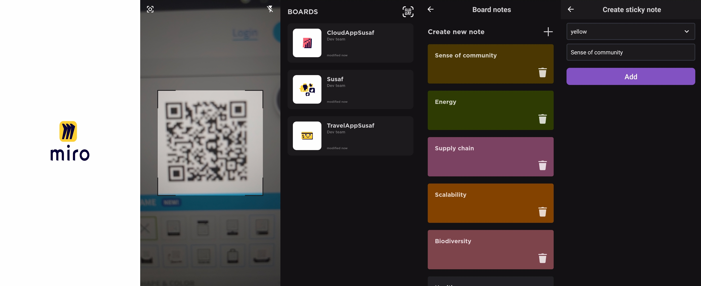

# MiroNote

This is an Android application that interacts with Miro board and transfers the notes of users to the board in real time.

Features:
- Authorization is done with simple QR code.
- Access all Miro boards.
- Create sticky notes of different colors.
Architecture:
- MVVM was chosen as architectural pattern. This pattern helps us seperate ui logic from backend logic. 
- As dependency injection Dagger 2 was chosen, because it is more reliable in the market if the project is big.
The reason of chose is that I am planning to extend the application and upload it to PlayMarket.
- One-activity-based-app is done following Google's best practice. And smooth navigation between fragments is made.
- Following DRY principle, I made custom views to avoid duplicated views.

Dinara Garifollina
